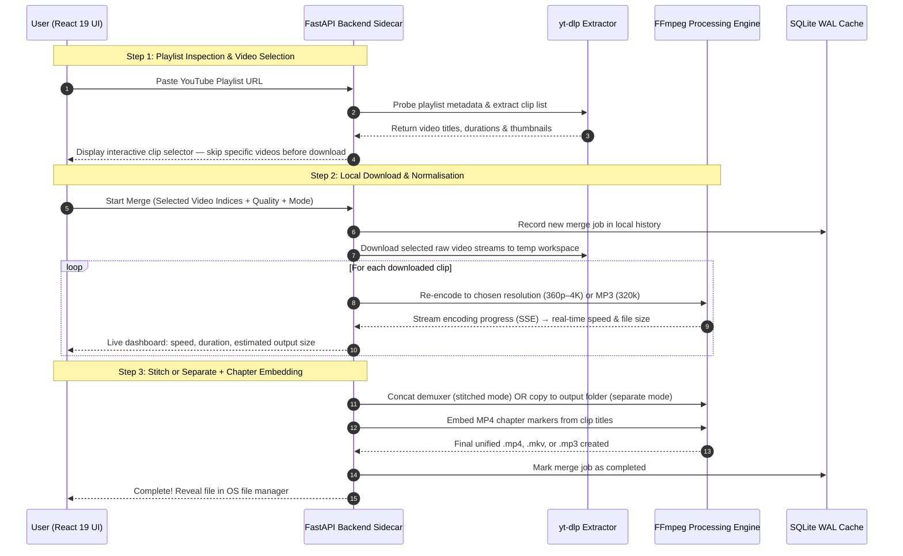

# TubeMerger 🎬

<p align="center">
  <a href="https://tubemerger.com"></a>
  <a href="https://tubemerger.com/download"></a>
  <a href="https://github.com/hashamtanveer-41/tubemerger/blob/main/LICENSE"></a>
  <a href="https://alternativeto.net/software/tubemerger/"></a>
  <a href="https://youtu.be/9UKKVZPkXHk"></a>
</p>

<p align="center">
  
  
  
  
  
  
</p>

**[TubeMerger](https://tubemerger.com)** is a 100% free, open-source desktop application for Windows, macOS, and Linux that lets you **[download YouTube playlists](https://tubemerger.com/download)**, **[merge full playlists into a single seamless video](https://tubemerger.com/playlist-to-single-video)** with automatic chapter markers, **download 4K Ultra HD single videos & Shorts**, and **extract or stitch 320kbps MP3 audio albums**. Powered by `yt-dlp` and `FFmpeg` running entirely on your local machine, TubeMerger is an ad-free media workstation with no cloud queues, no account registrations, and no artificial duration caps.

What makes TubeMerger different from bulk download tools is its granular control and rich desktop capabilities. You get an interactive playlist inspector to cherry-pick or skip clips with one click, dynamic bitrate-aware file size recalculation, native process-level pause/resume, sequential background queuing to prevent bandwidth choking, and instant diagnostics for commercial streaming links (like Spotify and Apple Music).

---

## 🎥 Demo Video

See TubeMerger in action — pasting a playlist, skipping unwanted clips, choosing resolution, and exporting offline:

[](https://youtu.be/9UKKVZPkXHk)

> 📺 **[Watch the full demo walkthrough on YouTube](https://youtu.be/9UKKVZPkXHk)**

> 📖 **Read the Engineering Deep Dive:** Want to learn how TubeMerger handles dynamic canvas scaling, audio drift normalization, and local SSE progress streaming? Read the full article on Dev.to:  
> 👉 **[How I Built an Offline YouTube Playlist Downloader & Merger with FastAPI, React, and FFmpeg](https://dev.to/hasham41/how-i-built-an-offline-youtube-playlist-downloader-merger-with-fastapi-react-and-ffmpeg-49n)**

---

## Core Features

### 🎬 Stitched or Separate Playlist Downloads
Choose exactly how your output is structured:
- **Stitched Mode**: Concatenates all selected videos into one continuous master video (`.mp4` or `.mkv`) with embedded chapter markers at each clip boundary — perfect for archiving an entire course, lecture series, tutorial, or documentary.
- **Separate Mode**: Downloads each chosen clip as its own individual file in a clean subfolder, giving you full flexibility without any manual splitting afterwards.

### 📥 4K Ultra HD Video & Shorts Downloader
Download individual YouTube videos and Shorts in up to **4K Ultra HD (2160p)**, **1440p (2K)**, **1080p (Full HD)**, **720p**, **480p**, and **360p**. Includes real-time video thumbnail preview, channel attribution, duration, and instant quality selection.

### 🎵 Audio Studio (320kbps MP3 Extraction & Album Stitching)
Dedicated audio workspace supporting single audio extraction and multi-track playlist merging:
- **Bitrate Presets**: Choose between **320 kbps (Extreme HQ / Audiophile)**, **256 kbps (High Quality)**, **192 kbps (Standard)**, or **128 kbps (Compact)**.
- **Continuous MP3 Albums**: Merge an entire music playlist into a continuous audio album or audiobook.
- **Dynamic File Size Calculation**: Pre-calculates expected download and output file sizes instantly as you switch bitrates.

### ⏸️ Process-Level Instant Pause & Resume
Freeze long-running downloads or FFmpeg stitches at any time. Powered by OS-level process tree signals (`SIGSTOP`/`SIGCONT` on Linux/macOS and thread suspension on Windows via `psutil`), pausing halts all CPU and disk activity immediately without losing downloaded chunks or restarting jobs from scratch.

### 📋 Sequential Queue Manager
Batch-process multiple playlists and videos without congesting your home network. TubeMerger's queue worker processes jobs sequentially one-by-one, preventing ISP bandwidth throttling, packet loss, and YouTube 429 rate-limiting.

### ✂️ Granular Playlist Control
Never download a video you don't want. The playlist inspector displays each video's title, thumbnail, and duration before any download begins. Toggle individual clips on or off with one click, select all, deselect all, and preview the resulting stitched runtime.

### 🧭 Interactive Tour Guide & Smart Diagnostics
- **Spotlight Tour**: Interactive, step-by-step onboarding walkthrough that highlights key interface elements for first-time users.
- **Platform Error Diagnostics**: Intelligent detection and guidance for multi-URL pastes, commercial streaming links (Spotify, Apple Music, Tidal), private/unlisted restrictions, and age-gated videos.

---

## Additional Capabilities

- **Automated Chapter Demuxing** — Embeds seekable MP4 chapter markers from each video's title. Works natively in VLC, QuickTime, Windows Media Player, and modern media players.
- **Smart Audio Normalization** — Re-encodes audio tracks to uniform 44.1 kHz AAC or MP3 stereo to eliminate volume spikes across merged clips.
- **100% Local & Private Processing** — `yt-dlp` and `FFmpeg` execute directly on your hardware. No videos, URLs, or personal data ever pass through remote cloud servers.
- **Persistent SQLite History** — Review past merges, open output folders, or replay completed videos directly from the local SQLite WAL history log.
- **Auto Binary Management** — Automatically detects or provisions portable `FFmpeg` and `yt-dlp` binaries to `~/.tubemerger/bin/` on first launch.
- **Modern SEO & Web App Metadata** — Complete Open Graph, Twitter Cards, dynamic document titles, and JSON-LD `SoftwareApplication` structured schema.
- **Completely Free & Open Source** — Zero paywalls, no device caps, no subscriptions, and no license keys. MIT licensed.

---

## Processing Pipeline



---

## System Architecture & Directory Layout

```
tubemerger/
├── assets/                                      # Branded assets & studio panoramic artwork
│   ├── banner.jpg                               # "We Build to Make Your Life Easier" banner
│   └── logo.png                                 # TubeMerger identity badge
├── docs/                                        # Architecture & engineering specifications
│   └── PRODUCTION_ISSUES_AND_SOLUTIONS.md       # Technical issue resolution post-mortem
├── frontend/                                    # Modern React 19 + TypeScript + Vite SPA
│   ├── src/
│   │   ├── components/
│   │   │   ├── ui/                              # Primitive components (Button, Badge, Spinner, Toast)
│   │   │   ├── layout/                          # Header, Sidebar, Navigation
│   │   │   ├── playlist/                        # PlaylistCard, VideoTable clip cherry-picker
│   │   │   ├── merge/                           # Action panels, ProgressSpotlight, FloatingActionBar
│   │   │   └── tour/                            # SpotlightTour interactive onboarding guide
│   │   ├── views/
│   │   │   ├── HomeView.tsx                     # Universal search & feature launchpad
│   │   │   ├── DiscoveryView.tsx                # Playlist clip inspector & granular selector
│   │   │   ├── SingleVideoView.tsx              # 4K Ultra HD video & Shorts downloader
│   │   │   ├── AudioView.tsx                    # Audio Studio (320kbps MP3 extraction & albums)
│   │   │   ├── QueuesView.tsx                   # Sequential multi-playlist background queue
│   │   │   └── HistoryView.tsx                  # Local SQLite merge history log
│   │   ├── hooks/useMergeApp.ts                 # Unified application state manager
│   │   └── services/api.ts                      # Strongly typed REST client & SSE subscriber
│   └── dist/                                    # Pre-compiled production bundle with SEO schema
├── src/
│   └── tubemerge/                               # Python Backend (Modular Apps)
│       ├── core/
│       │   ├── settings.py                      # Application settings, paths & canvas presets
│       │   └── config.py                        # Feature flags & monetization settings
│       ├── db/
│       │   └── connection.py                    # SQLite WAL connection manager & auto-migrations
│       ├── apps/
│       │   ├── binaries/                        # FFmpeg & yt-dlp locator & auto-installer
│       │   ├── playlists/                       # YouTube metadata, URL sanitizing & DRM diagnostics
│       │   ├── merger/                          # FFmpeg normalizer, concat stitcher, MergeEngine
│       │   │   ├── services/
│       │   │   │   ├── engine.py                # Download → normalise → stitch pipeline
│       │   │   │   ├── normalizer.py            # FFmpeg per-clip re-encode (libx264 + AAC/MP3)
│       │   │   │   └── stitcher.py              # FFmpeg concat + chapter metadata embed
│       │   │   ├── controllers/merge_controller.py
│       │   │   └── routes.py                    # /api/start-merge, /api/progress, /api/pause, /api/resume
│       │   ├── history/                         # Local merge job history management
│       │   ├── queues/                          # Sequential merge job queue handling
│       │   ├── updates/                         # Startup update check & forced update enforcement
│       │   ├── system/                          # Native OS file integration (xdg-open / explorer)
│       │   └── telemetry/                       # Aptabase anonymous counter service
│       ├── server/app.py                        # FastAPI application mounting SPA and routers
│       └── app.py                               # PyWebView desktop window / browser launcher
├── website/                                     # Official Marketing Landing Page & Web Docs
│   ├── src/                                     # React + Tailwind CSS marketing site
│   ├── public/                                  # Static brand assets, sitemap & robots.txt
│   ├── vercel.json                              # Vercel deployment configuration (tubemerger.com)
│   └── package.json                             # Website build dependencies
├── scripts/
│   └── bump_version.py                          # Atomic version bump across all project files
├── tests/                                       # OOP unit and integration test suite (35 tests)
├── main.py                                      # Primary application entrypoint
├── pyproject.toml                               # PEP 621 packaging metadata
└── requirements.txt                             # Python dependencies
```

---

## Privacy-Preserving Analytics (Aptabase)

TubeMerger incorporates privacy-first, GDPR-compliant volumetric telemetry via [Aptabase](https://aptabase.com).

- **Region**: EU (`https://eu.aptabase.com`)

### Privacy Guarantees

1. **Zero Personally Identifiable Information (PII)**: No usernames, IP addresses, device identifiers, or hardware fingerprints are collected.
2. **No URLs or Video Metadata**: YouTube URLs, playlist links, channel names, and video titles are **never transmitted** or logged.
3. **Clip Count Bucketing**: Raw numbers of selected clips are never sent; they are bucketed into generic categories (`small` for ≤ 20 clips, `large` for > 20 clips).
4. **Tracked Events**:
   - `app_started`: Anonymous ping on desktop app startup.
   - `playlist_merge_started`: Dispatched when a merge pipeline starts (with `size_bucket`).
   - `playlist_merge_completed`: Dispatched upon successful job finish (with duration bucket).

### Disabling Telemetry

Telemetry can be disabled at any time by setting `TELEMETRY_APP_KEY = ""` in `src/tubemerge/core/config.py`:

```python
# src/tubemerge/core/config.py
TELEMETRY_APP_KEY: str = ""  # Set to empty string to disable telemetry
```

---

##  Download Desktop Binaries (No Setup Required)

If you just want to use TubeMerger without setting up Python or Node.js:

| Platform | Download | Format |
| :--- | :--- | :--- |
| **Windows** | [Download for Windows](https://github.com/hashamtanveer-41/tubemerger/releases/latest) | `.exe` / Installer |
| **Linux (Ubuntu/Debian)** | [Download for Linux](https://github.com/hashamtanveer-41/tubemerger/releases/latest) | `.deb` / Executable |
| **macOS** | [Download for macOS](https://github.com/hashamtanveer-41/tubemerger/releases/latest) | `.dmg` (Universal) |

*Or visit the [official download page](https://tubemerger.com/download) on tubemerger.com.*

---

## 🛠 Quick Start

### 1. Prerequisites
- **Python 3.10+** (Python 3.10, 3.11, 3.12, 3.13, 3.14 supported)
- **Node.js 18+ & npm** (only needed if building frontend from source)
- **FFmpeg & yt-dlp** (Auto-detected from PATH or automatically downloaded on first launch to `~/.tubemerger/bin/`)

### 2. Installation
```bash
git clone https://github.com/hashamtanveer-41/tubemerger.git
cd tubemerger

# Optional: Create and activate virtual environment
python3 -m venv .venv
source .venv/bin/activate  # On Windows: .venv\Scripts\activate

# Install requirements
pip install -r requirements.txt
```

### 3. Running the Application
```bash
python3 main.py
```
*The app automatically launches a native desktop GUI window (PyWebView) or opens in your default browser at `http://127.0.0.1:7842`.*

---

## 💻 Frontend Development (Optional)

If modifying the React user interface:
```bash
cd frontend

# Install Node dependencies
npm install

# Start Vite live development server
npm run dev

# Compile production bundle into frontend/dist/
npm run build
```

---

## 🧪 Automated Testing

Run the comprehensive unit test suite:
```bash
python3 -m unittest discover tests
```

---

## 🔖 Version Management

Bump versions atomically across all project files with the included script:
```bash
python3 scripts/bump_version.py 1.0.6          # apply
python3 scripts/bump_version.py 1.0.6 --dry-run # preview only
```

---

## 📄 License
This project is licensed under the **[MIT License](LICENSE)** — free for personal and commercial use.  
*Copyright © 2026 TubeMerger Contributors.*
